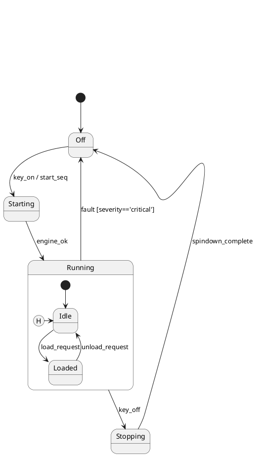
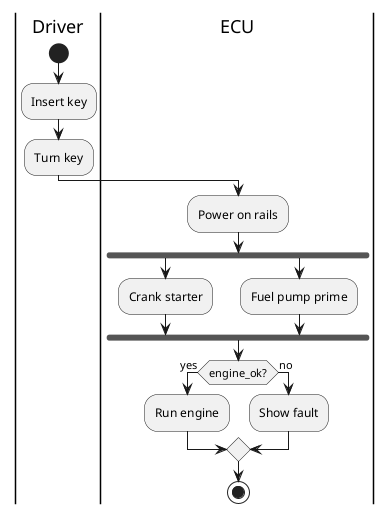
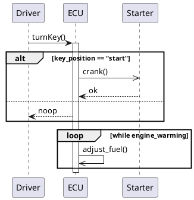
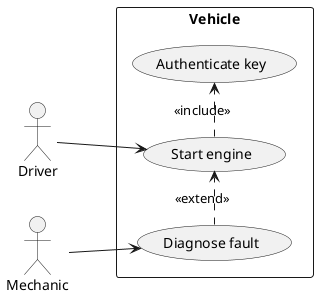
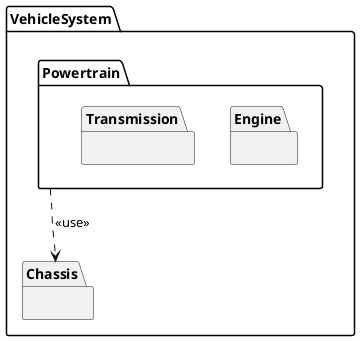

# Research: Full SysML v2 Diagram Coverage

**Date**: 2026-05-20
**Feature**: specs/002-full-sysml-diagrams

All "NEEDS CLARIFICATION" markers were resolved during `/speckit-clarify` (see [spec.md § Clarifications](spec.md#clarifications)). This document records the technical research that informs the implementation plan.

---

## 1. PlantUML native diagram modes per SysML diagram

### Decision
For each of the six PlantUML-routed diagram directives, the directive body uses PlantUML's native diagram mode (not the class-diagram approximation that `needsysml-bdd` uses). PlantUML's syntax is wrapped inside `@startuml`/`@enduml` by `needuml`; the `:config: sysml_<diagram>` line supplies the skinparam styling.

### Rationale
PlantUML's native modes give richer fidelity than reusing the class-diagram engine for every SysML diagram:

- **State machine** — first-class `state X`, nested `state X { state Y }`, transitions `X --> Y : trigger [guard] / effect`, history pseudostates `[H]` / `[H*]`, choice via `state x <<choice>>`, junction via `state x <<junction>>`.
- **Activity** — beta activity syntax: `start`, `:Action;`, `if (cond?) then (yes) … else (no) endif`, `fork`, `fork again`, `end fork`, `partition "Lane" { … }` for swimlanes, `:Action| object;` for object flows.
- **Sequence** — `participant A`, `A -> B : msg` (sync), `A ->> B : msg` (async), `A --> B : return`, combined fragments: `alt`/`else`/`end`, `opt`, `loop`, `par`/`else`, `break`, `critical`.
- **Use case** — `actor :A:`, `usecase (UC1) as UC1`, `:A: --> UC1`, `UC1 .> UC2 : <<include>>`, `UC1 .> UC2 : <<extend>>`, `rectangle "SystemName" { … }` for the system boundary.
- **Package** — `package "Name" { }`, nesting allowed, dependencies `pkgA ..> pkgB : <<import>>` (or `<<use>>` / `<<realize>>`).
- **Parametric** — falls back to the class-diagram engine: `class "fuel_eq" <<constraint>> { expression }` with binding connectors `param ..> value_prop : "kW"`. Acknowledged in docs as an approximation.

### Alternatives considered
- **Reuse class-diagram syntax for every diagram** — uniform but ugly for activities and sequences. Rejected because PlantUML state/activity/sequence/use case modes are well-supported and produce idiomatic output.
- **Compile to Mermaid** — Mermaid is a Sphinx-needs option for some users but doesn't cover sequence combined fragments well and has no parametric story. Rejected.
- **Bring in a separate UML library** (e.g. `plantweb`) — adds an external service dependency. Rejected; sphinx-needs already wraps `sphinxcontrib-plantuml`.

### Code patterns

**State machine** (sysml_stm):


**Activity** (sysml_act):


**Sequence** (sysml_sd):


**Use case** (sysml_uc):


**Package** (sysml_pkg):


**Parametric** (sysml_par — class diagram approximation):
```plantuml
@startuml
skinparam class<<constraint>> { BackgroundColor #FFF0DC }
class "FuelConsumption" <<constraint>> {
    fuel = output * duration / efficiency
    --
    + output : ConstraintParameter
    + duration : ConstraintParameter
    + efficiency : ConstraintParameter
    + fuel : ConstraintParameter
}
"engine.output" --> "FuelConsumption::output" : "kW"
"drive.duration" --> "FuelConsumption::duration" : "s"
"engine.efficiency" --> "FuelConsumption::efficiency" : ""
"FuelConsumption::fuel" --> "trip.fuel_used" : "L"
@enduml
```

---

## 2. sphinx-need-svg deferred-rendering pattern

### Decision
Every new `-svg` companion directive registers a `sphinx_need_svg.directives.needsvg.Needsvg` placeholder node and stores its template body in `env.needsvg_all_data[targetid]`. Rendering happens later in `process_needsvg` (connected to `doctree-resolved`). The new directives **do not** call `SphinxNeedsData.get_needs_view()` themselves.

### Rationale
The currently-fixed `needsysml-bdd-svg` directive used to call `render_jinja_svg` inside its own `run()` method, which transitively called `SphinxNeedsData(env).get_needs_view()` during doctree-read. That froze the needs registry — every subsequent `partdef`/`part`/etc. directive on the same page failed with `Needs have already been post-processed and frozen`. The fix is to defer rendering until `doctree-resolved` (after all needs are collected). The existing `sphinx_need_svg.directives.needsvg` module already implements that pattern, so the SVG variants reuse it.

### Pattern (canonical, from `needsysml_svg.py`)

```python
from sphinx_need_svg.directives.needsvg import Needsvg
from docutils import nodes

class NeedsymlXxxSvgDirective(SphinxDirective):
    def run(self) -> list[Any]:
        # Build template by string-substituting the root arg and option values
        # into the canonical svg template for this diagram type.
        content = _SVG_TEMPLATE_FOR_THIS_DIAGRAM \
            .replace("__ROOT_ID__", self.arguments[0]) \
            .replace("__FILTER_EXPR__", filter_expr.replace('"', '\\"'))

        env = self.env
        targetid = f"needsvg-{env.docname}-{env.new_serialno('needsvg')}"
        env.needsvg_all_data = getattr(env, "needsvg_all_data", {})
        env.needsvg_all_data[targetid] = {
            "docname": env.docname,
            "lineno": self.lineno,
            "content": content,
            "options": {
                "width": self.options.get("width", "100%"),
                "height": "auto",
                "align": self.options.get("align", "center"),
                "debug": False,
            },
        }
        targetnode = nodes.target("", "", ids=[targetid])
        node = Needsvg("")
        node["targetid"] = targetid
        return [targetnode, node]
```

### Alternatives considered
- **Custom placeholder + own doctree-resolved handler** per directive — duplicates `process_needsvg` six times. Rejected.
- **Eager rendering with manual `app._needs_registry_frozen` reset** — fights the framework. Rejected.

---

## 3. Pseudostate notation

### Decision
PlantUML state machine syntax supports every pseudostate kind chosen in spec clarification Q2:

| Pseudo kind | PlantUML syntax |
|---|---|
| `initial` | `[*] --> NextState` |
| `final` | `NextState --> [*]` |
| `shallowHistory` | `state hist <<history>>` then `hist --> Foo` |
| `deepHistory` | `state hist <<history*>>` then `hist --> Foo` |
| `choice` | `state c <<choice>>` then `[*] --> c`, `c --> A : [g==1]`, `c --> B : [g==2]` |
| `junction` | `state j <<junction>>` (same wiring as choice; junction is a static merge, choice is dynamic) |

Initial and final are already covered by existing `is_initial` / `is_final` boolean fields, but the renderer must translate them into the `[*]` syntax when emitting transitions. History/choice/junction need a new `pseudo_kind` field.

### Rationale
The chosen set (Q2 = Option B) matches what PlantUML can express natively — no custom rendering required. Pseudostates are represented as kinds of state, not separate need types, matching SysML v2's metamodel.

### Field design
Add `pseudo_kind` to `SYSML_FIELDS`:
```python
{
    "name": "pseudo_kind",
    "description": "Pseudostate kind: initial / final / shallowHistory / deepHistory / choice / junction",
    "schema": {"type": "string", "enum": [
        "initial", "final", "shallowHistory", "deepHistory", "choice", "junction"
    ]},
}
```

### Alternatives considered
- **Six new need types** (`InitialPseudostate`, `FinalPseudostate`, …) — bloats the type registry; pseudostates are conceptually states, not first-class elements. Rejected.
- **Boolean flags per kind** (`is_choice`, `is_history`, …) — six booleans where one enum suffices. Rejected.

---

## 4. Swimlane (activity partition) syntax

### Decision
Use PlantUML activity-beta `partition "Name" { … }` blocks. The activity directive's Jinja template iterates over distinct values of a new `partition` field on actions and emits one partition block per unique value.

### Rationale
PlantUML's activity beta syntax has first-class swimlanes. Native swimlanes also render correctly in PDF when the PlantUML output format is `svg`.

### Template skeleton
```jinja2
@startuml


    
        |{{ partition_name }}|
    
    
        :{{ action.title }};
    


    {{ cf.from_action }} --> {{ cf.to_action }}

@enduml
```

### Field design
Add `partition` (string) to `SYSML_FIELDS`. Optional — actions with no partition render at the top level.

---

## 5. Combined fragments (sequence diagrams)

### Decision
Each message belongs to at most one fragment, identified by the `fragment` field (pointing to a `MessageFragment` instance) and a `fragment_kind` enum. PlantUML emits the fragment frame around the contained messages.

### Rationale
SysML/UML supports all six combined-fragment kinds enumerated in spec FR-006 (`alt`, `opt`, `loop`, `par`, `neg`, `critical`). PlantUML natively renders all of them. Modeling fragments as elements (rather than implicit ranges) lets us list and link to them like any other need.

### Field design
- `fragment_kind`: enum string (`alt` / `opt` / `loop` / `par` / `neg` / `critical`) on `Message`.
- `fragment_guard`: optional string (the guard expression printed in the frame header).
- For multi-message fragments: messages share the same `fragment` group via a `fragment_group` string. The renderer wraps any group of messages with a common `fragment_group` in a single PlantUML fragment block.

### Alternatives considered
- **A separate `MessageFragment` need type** — more explicit but introduces extra cross-references. Reserved for a future enhancement; v1 uses fragment_group/fragment_kind on the messages themselves.

---

## 6. Use case extends / includes / generalizes

### Decision
Three string fields on `UseCase`: `extends`, `includes`, `generalizes`, each holding a comma-separated list of `USECASE-NNN` IDs (matching the existing comma-list convention for `satisfies` / `refines` / `allocates`).

### PlantUML output
- `extends` → dashed `..>` from the extending UC to the extended UC, labelled `<<extend>>`.
- `includes` → dashed `..>` from the including UC to the included UC, labelled `<<include>>`.
- `generalizes` → solid arrow `-->` with hollow triangle head from child to parent. PlantUML's syntax for that is `<|--`.

### Subject (system boundary)
`UseCase.subject` is a string holding the system-boundary name (free text, not a need ID). The renderer wraps all use cases that share the same `subject` value inside one `rectangle "subject" { … }`. Multiple subjects on one diagram are allowed.

### Rationale
String fields match the existing comma-list convention so engineers don't need a new mental model. Subject is free-text rather than a need ID because a "system boundary" in UC diagrams is a label, not a separately-modeled entity in this extension.

---

## 7. Allocation matrix renderer

### Decision
The matrix directive emits a `docutils.nodes.table` with row headers = needs matching `:rows:` filter, column headers = needs matching `:columns:` filter, and a marker (✓ in HTML, "X" in plain-text outputs) at intersections where the row need's `allocates` field references the column need's ID. Defaults per spec Q3 are `:rows:` = needs with `allocates != ""`, `:columns:` = needs referenced by any `allocates` value.

### Rationale
A docutils table picks up the active Sphinx theme's table styling (immaterial, alabaster, etc.) and renders identically in HTML, PDF, and ePub. Unlike SVG diagrams, the matrix is queryable in non-HTML outputs.

### Pseudocode
```python
def run(self):
    rows_filter = self.options.get("rows", 'allocates != ""')
    cols_filter = self.options.get("columns", _DEFAULT_COLS_FILTER)
    rows = filter_needs_view(needs, config, rows_filter)
    cols = sorted({need.id for r in rows for need in r.allocates.split(",")})
    cols_filtered = [c for c in cols if c in needs and _match(needs[c], cols_filter)]
    table = nodes.table(...)
    # header row: empty cell, then col-need refs
    # data rows: row-need ref, then ✓ / ∅ markers per col
    return [table]
```

### Alternatives considered
- **SVG matrix** — overkill; tables already exist as a first-class docutils node. Rejected.
- **Reuse `needtable`** — `needtable` does not natively support a row-vs-column matrix layout; it produces one row per need. Rejected (but the implementation can borrow filter parsing from `needtable`).

---

## 8. Test fixture strategy

### Decision
Each new directive gets its own pytest module + `tests/doc_test/<directive>/` fixture (one `conf.py` + one `index.rst`). Fixtures are minimal: one `statedef` + three states + three transitions for `test_stm_directive.py`, etc. Smoke tests assert (a) `app.build()` finishes with no unexpected warnings, (b) at least one fixture-defined need ID appears in the rendered doctree.

### Rationale
Matches the existing convention used by `test_bdd_directive.py` / `test_ibd_directive.py` / `test_req_directive.py`. Per-directive fixtures keep failures isolated — when `test_stm_directive.py` fails it doesn't drag down the sequence-diagram fixture.

### One-shot smoke pattern
```python
import pytest
from sphinx.testing.fixtures import make_app, shared_result

@pytest.fixture
def stm_app(make_app, tmp_path):
    # copy doc_test/stm to tmp_path, build with html, return app
    ...

def test_stm_builds_without_error(stm_app):
    stm_app.build()
    assert not stm_app.statuscode

def test_stm_renders_fixture_state(stm_app):
    stm_app.build()
    text = stm_app.env.get_doctree("index").astext()
    assert "SD-001" in text or "Off" in text
```

### Alternatives considered
- **One mega-fixture used by every test** — couples failure modes; if one test corrupts the build env, others cascade. Rejected.

---

## 9. Two-phase release packaging

### Decision
- v1 (`sphinx-need-sysml 0.3.0`): User Stories 1–5 — `needsysml-stm`, `needsysml-act`, `needsysml-sd`, `needsysml-uc`, `needsysml-pkg` (each with `-svg` companion).
- v1.1 (`sphinx-need-sysml 0.4.0`): User Stories 6–7 — `needsysml-alloc` (matrix), `needsysml-par` (parametric, with `-svg` companion).

All thirteen new need types and ~22 fields ship in v1, even those used only by v1.1 directives. This keeps downstream user models stable across the two releases.

### Rationale
- Spec clarification Q5 = Option C.
- Registering the v1.1-only types in v1 means engineers using v1 can already declare `ConstraintBlock` / `ValueProperty` / `BindingConnector` in their models (queryable via tables) even before the parametric diagram directive exists. When v1.1 lands they just add `..needsysml-par::` directives without re-registering anything.

### Alternatives considered
- **Defer v1.1 element types to v1.1** — would force a data-model migration when v1.1 ships. Rejected because the registration cost is near-zero.
- **Single big-bang release** — rejected by user during clarification.

---

## 10. Backwards-compatibility scan

### Findings
The new feature has zero conflicts with the existing 001 feature's surface:

- No existing type names are reused. The 13 new prefixes (`TRANS-`, `CTRLFLOW-`, `OBJFLOW-`, `PKG-`, `DEP-`, `USECASE-`, `ACTOR-`, `CONSTRAINT-`, `PARAM-`, `VALUE-`, `BIND-`, `LIFELINE-`, `MSG-`) do not collide with the 14 existing prefixes (`PD-`, `P-`, `POD-`, `PO-`, `IFD-`, `IF-`, `CD-`, `C-`, `AD-`, `A-`, `SD-`, `SU-`, `RD-`, `R-`).
- `pseudo_kind` is a new field; existing `is_initial` / `is_final` continue to work and are still honored by the renderer.
- `needsysml-req`'s positional filter argument stays valid; the new `:filter:` option only fires when present.
- The existing `needsysml-bdd-svg` directive remains unchanged.

### Pre-existing test failure (out of scope)
`tests/test_req_directive.py::TestReqDirective::test_req_filter_expression_respected` is failing on `main` before this feature begins (see git stash test in the work session). It is **not** caused by this feature and **not** in scope to fix here. The plan does not regress it further; success criterion SC-007 measures regression beyond that baseline.
